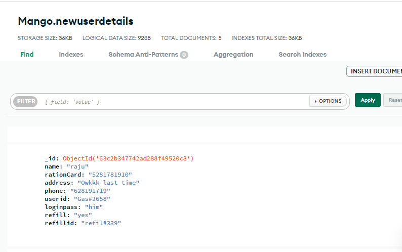
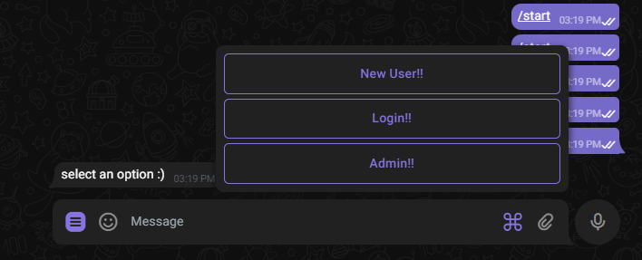
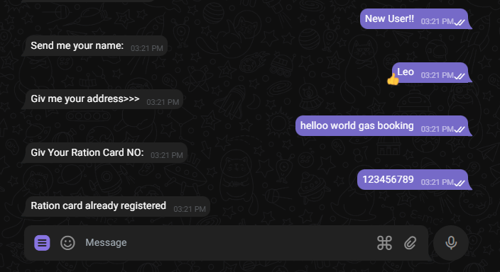
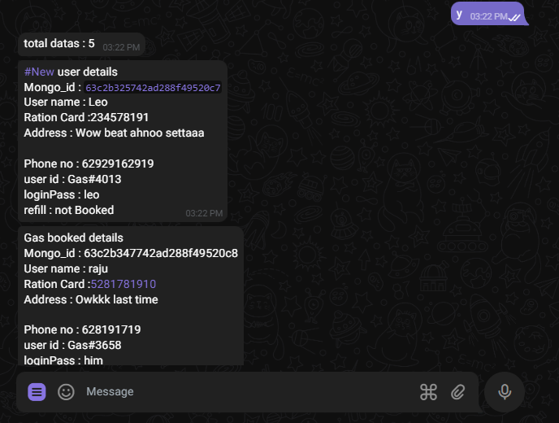

 
# Collage Micro Project Prototype Model
Gas Booking System on telegram with Mongo-db
1. Helps to Book Gas through Telegram
2. User can create account with password
3. User can login and Book Gas through single login option
4. Admin can view new-users and new Booking

### Environment Variables
* `api_id`(required) - Get your telegram API_ID
* `api_hash`(required) - Get your telegram API_HASH
* `bot_token`(required) - your bot token
* `admin`(required) - Authorised user id
* `MONGO_URL`(required) - Mongodb database URI

### Run bot
1. `git clone https://github.com/Roshan-Here/Micro-Project-Prototype`
2. pip install -r requirements.txt
3. Edit `Config.py with your own variables
4. `python3 GasBooking.py`

### Details

### Contributions
Contributions are welcome.

## License
Code released under [The GNU General Public License](LICENSE).